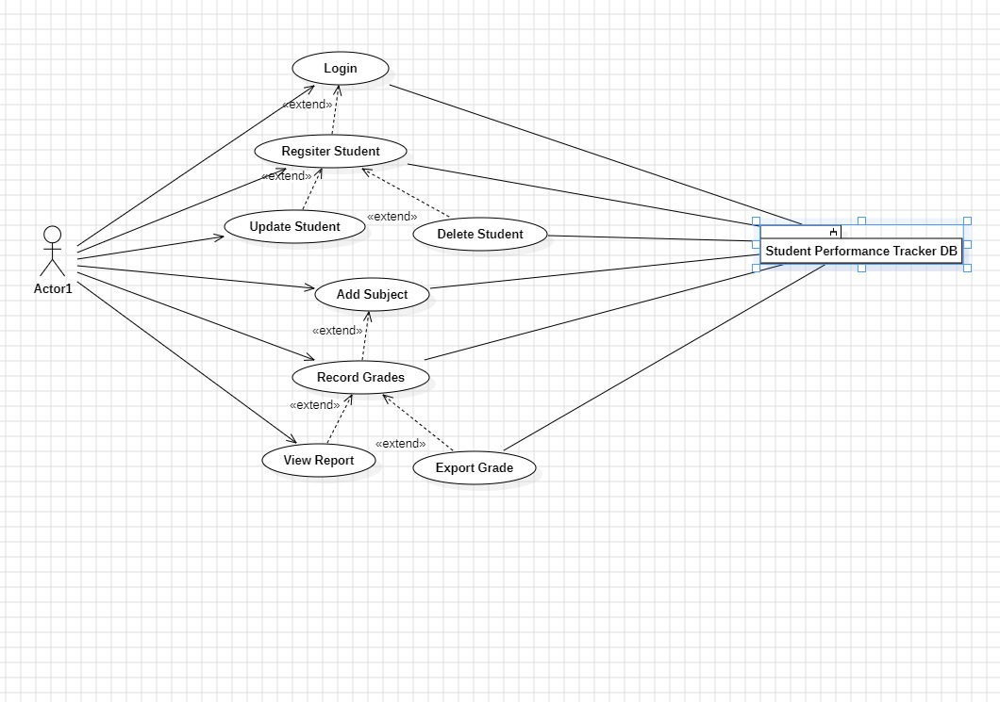
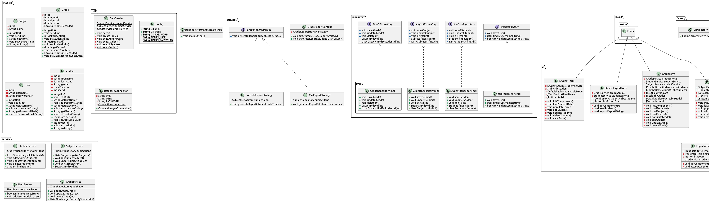

# Course Project Report

**Student Performance Tracker**

**Course:** Modern Programming Practices  
**Block:** July 2025  
**Instructor:** Dr. Bright Gee Varghese R  

**Team Members:**  
[Olamide Boluwatife Akinoso]  [619563]  
[Azeem Ullah Baig]  [619573]  

**Date of Submission:** 07/14/2025  

---

## 1. Problem Description

Tracking student academic performance manually can lead to inconsistencies, inefficiencies, and loss of data. The Student Performance Tracker aims to streamline the management of student records, subject entries, grades, and performance reporting in a unified and digital system. With this tool, administrators can log student data, assign subjects, record and update grades, and export reports. The motivation is to increase accuracy, reduce redundancy, and provide a reliable way of monitoring and improving student learning outcomes.

---

## 2. User Stories
- As an Admin, I want to register, update, or delete student records so that the database remains current.  
- As an Admin, I want to add new subjects so that students can be assigned accordingly.  
- As an Admin, I want to record grades so that student performance can be evaluated.  
- As an Admin, I want to view reports so that I can monitor student progress.  
- As an Admin, I want to export grade reports so that they can be shared or printed.  

---

## 3. Functional Requirements
- Login functionality  
- Register, update, and delete student records  
- Add subjects  
- Record and update grades  
- Generate and export student performance reports  

---

## 4. Non-Functional Requirements
- Usability: Easy-to-use interface  
- Reliability: Data should persist across sessions  
- Security: Only authenticated users can access the system  
- Performance: Quick response times  
- Scalability: Accommodates future expansion  

---

## 5. Architecture of Project

### 5.1 Overview
The application follows a layered architecture pattern, separating concerns between UI, services, and data access.

### 5.2 Architecture Diagram
(See attached architecture diagram image)

### 5.3 Technologies Used
- Java 21  
- JavaFX for GUI  
- JDBC for Database Access  
- MySQL as Database  
- JUnit for Unit Testing  
- Stream API for Data Operations  

### 5.4 Layer Descriptions
- **Presentation Layer:** GUI forms that interact with the user (e.g., LoginForm, StudentForm)  
- **Service Layer:** Contains business logic (StudentService, GradeService, etc.)  
- **Data Access Layer:** DAO classes that interact with the database (StudentRepository, GradeRepository)  
- **Database:** MySQL backend storing student, subject, and grade information  

---

## 6. Use Case Diagram(s)


---

## 7. Use Case Descriptions

### Use Case: Register Student
- **Actor:** Admin  
- **Preconditions:** Admin is logged in  
- **Postconditions:** Student record is saved to the database  
- **Main Success Scenario:**  
  1. Admin opens the Register Student form  
  2. Admin fills in the student information  
  3. System validates the input  
  4. Student record is saved  
  5. Confirmation is shown  

### Use Case: Record Grades
- **Actor:** Admin  
- **Preconditions:** Student and Subject must exist  
- **Postconditions:** Grade is recorded  
- **Main Success Scenario:**  
  1. Admin opens Record Grades form  
  2. Selects student and subject  
  3. Enters grade  
  4. Grade is saved to DB  

### Use Case: View Report
- **Actor:** Admin  
- **Preconditions:** Grades must be recorded  
- **Postconditions:** Performance report is displayed  
- **Main Success Scenario:**  
  1. Admin selects student  
  2. System fetches grades  
  3. Report is generated and shown  

---

## 8. Class Diagram


---

## 9. Sequence Diagrams
Generate CSV report Sequence Diagram


---

## 10. Screenshots
- Login Form  


- Dashboard


- Register Student Form  


- Subject Entry Form  


- Record Grades Form  


- View Report  


---

## 11. Installation & Deployment

### Instructions:
1. Clone the Repository:
```bash
git clone https://github.com/yourrepo/student-performance-tracker
```
2. Set Up Environment:
- JDK 21  
- JavaFX libraries  
- MySQL database  

3. Database Setup:
- Import `schema.sql` into MySQL  

4. Run Application:
- Open in IntelliJ  
- Run MainApp  

5. Run Unit Tests:
- Navigate to `src/test` package  
- Run test suite with JUnit  

---

## 12. How to Use
- Login with credentials  
- Navigate through tabs/forms to register students, subjects, and grades  
- Use report tab to generate and export performance reports  

---

## 13. Design Justification & Principles
- **Interfaces:** Used for abstraction between services and repositories  
- **Abstract Classes:** None used as design did not require inheritance hierarchy  
- **Liskov Principle:** All subclasses/interfaces adhere to parent contracts  
- **Open-Closed Principle:** Services and models are extendable but not modifiable  
- **Singleton Pattern:** Used in `DBConnectionManager` to manage a single DB instance  
- **Stream API:** Used in grade aggregation and reporting (e.g., average, filtering)  

---

## 14. Team Members
- Olamide Boluwatife Akinoso (619563)
- Azeem Ullah Baig (619573)  

---

## 15. References
- Java API Documentation  
- JavaFX Tutorials  
- JDBC Guide  
- Oracle Java Docs  
- GitHub Java Projects (open source)  
- JUnit Official Documentation  
- Course Textbook and Lectures  
